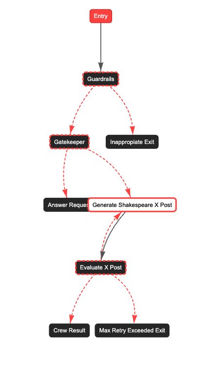

# Using Multi-Agent Systems and Making Smart Choices

## Best Practices for Designing Agents:
- [Crafting Effective Agents - CrewAI](https://docs.crewai.com/guides/agents/crafting-effective-agents)
- CoT System Prompts → Match your requirements

## Single Agent vs Multi Agent

 - Decide based on requirements, don't choose because its trendy.
 - A task that is not time sensitive (e.g. sending travel recommendations as an email to the user based on his/her booking), multi-agent works well since it is not a "chat" interaction.
 - For a "chat" interface, must be careful. Some prompts would require a multi-agent path but some prompts can be taken care of with a single agent or a direct instance of the LLM. 
 - Having this multi-faceted event-driven approach improves the user experience and reduces the response time significantly.
- This reference on [Notion](https://www.notion.so/utum/Agentic-AI-Systems-11a135e3444780bea39bef1c630a9259) can help you make better decisions on when to use a single vs multi-agent.

## Guardrails and Gatekeeper

- Have to reject harmful prompts to be compliant with EU AI act since you would be personally liable for any harm.
- Have to restrict the prompts that are irrelevant. For example, if the application is about chatting with your resume and the user asks an irrelevant question like "When was statue of liberty built?", the response should reject answering it, so that you don't become a free ChatGPT (you are paying for the API calls!)
- Can be achieved using moderation API's, guardrail frameworks, keyword matching, LLM as a judge (can involve some cost), training a classifier.

## Monitoring and Observability
- [AgentOps](https://www.agentops.ai/)
- [Langfuse](https://langfuse.com/)
- [Langtrace](https://www.langtrace.ai/)
- [MLflow](https://mlflow.org/)
- [OpenLIT](https://openlit.io/)
- [Arize](https://phoenix.arize.com/)
- [Comet Opik](https://www.comet.com/)
- [Portkey](https://portkey.ai/)
- [Weave](https://weave-docs.wandb.ai/)
- [OpenTelemetry](https://opentelemetry.io/)

## Event-Driven Orchestration of Single and Multi-Agents using CrewAI Flows

The example is taken from [this repository](https://github.com/bhancockio/flows-feedback-loop/tree/main), and then adapted to include guardrails, gatekeeper, and orchestration of direct LLM calls and multi-agent.

Refer to the [documentation](https://docs.crewai.com/concepts/flows) for more info on how to use flows.

