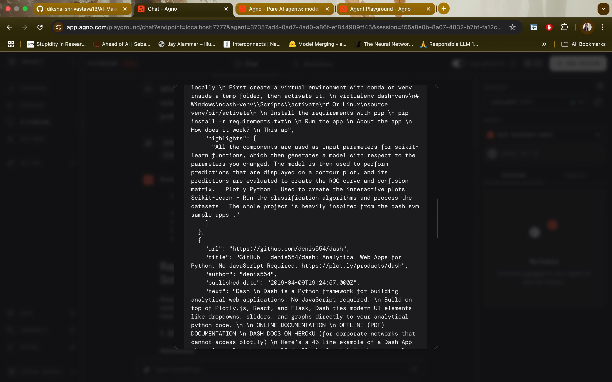

# Rapid Prototyping Agent

This directory contains all the code for the Rapid Prototyping Agent, made with the Agno stack. 
This workflow is meant to help primarily with researching the tools and technologies for rapid prototyping,
which most align with a product team's needs, depending on the time, budget and skill constraints.

It consists of two agents:

1. Deep Research Agent:
   - Crawls the internet for relevant tools, frameworks, libraries, methods, tutorials, and example 
   projects relevant to the user's requirements using Exa and Firecrawl APIs.
   - Conducts a comparative analysis of tools, prioritising the solutions which are well-documented, 
   actively maintained and have strong community backing.
   - Provides a detailed report.

2. Coding Agent:
   - Takes in user's choice of the tools and searches for relevant code examples, tutorials and technical blogs.
   - Generates basic coding examples to get started with a particular tool.
   - Can optionally wrap the tool usage in a FastAPI/Django backend. 

## Steps to Run

1. Install the Requirements: `uv pip install -r requirements.txt`

2. Obtain [Firecrawl](https://www.firecrawl.dev/app/api-keys) and [Exa](https://dashboard.exa.ai/api-keys) API keys. 
You can also opt to use DuckDuckGo Search for this example, as instructed [here](https://docs.agno.com/tools/toolkits/duckduckgo).

3. Follow the Agno Authentication steps [here](https://docs.agno.com/get-started/playground#authenticate-with-agno) 
to get a free API key from `app.agno.com`. 

4. Simply run `python main.py` to start the Agno Playground.

Read more on Agno Playground here: [Agno - Agent Playground](https://docs.agno.com/get-started/playground). The 
playground uses FastAPI and uvicorn to run teh agents on a simple chat interface, allowing for quickly testing the
responses and usefulness of the agents without requiring to develop an entire interface.

You can switch between the two agents using the right side menu, change the configurations and view history.
You can also opt to log the sessions, and use persistent memory with Postgres or Sqlite. See the documentation 
[here](https://docs.agno.com/introduction).

Note: While a "Junior Developer" team is present in the script, please note that agents can get stuck in loops when 
deployed as a team which can cost more tokens than needed. Using individual agents or agents in a well-defined workflow
is better practise.

## Demo Screenshots

The Deep Research Agent:

You can choose to view the tool usage result by selecting the tools listed at the beginning of any answer.

The Coding Assistant:

