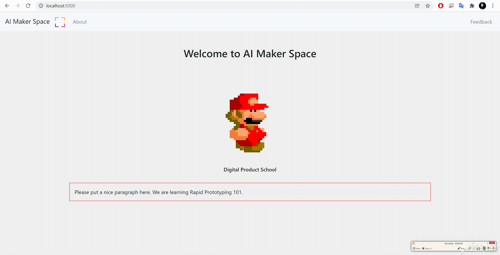

##  1/ Flask Server + Heroku | skkh001
---

<p class="ex1" align="justify" style="padding: 15px 15px 15px 15px">            
 Deploy basic Flask server to Heroku with basic HTML, CSS, JavaScript and Bootstrap. This repository connects Flask with HTML, CSS, JS files and supports Bootstrap CDN for responsible web applications.
</p>

##### Expectation: 
- Your responsive web application in Flask Server deployed to Heroku with prototype name and basic information.
- This prototype has Favicon, HTML+CSS+JS+Bootstrap CDN.

  


Step 1: clone the repository with `$git clone`

Step 2: Inside the repository, set virtual environment:
```powershell
> pip3 install virtualenv
> virtualenv env
> env\Scripts\activate
```
WIN: If running scripts is disabled in your windows system by default , then in PowerShell (admn):
```powershell
> Set-ExecutionPolicy RemoteSigned
```
to get back to original configuration `Set-ExecutionPolicy Restricted`.

Step 3: Install requirements:
```python
> pip3 install -r .\requirements.txt
```


Step 4: To run the server:
```python
> python app.py
```


• `NOTE:` In case of installation of new python library, don't forget to `$ pip freeze > requirements.txt`

 ### File Structure:
 ```
|-----|
       |--- Procfile
       |--- README.MD
       |--- app.py
       |--- requirements.txt
       |--- env (virtual environment)
       |--- app ---|
                   |--- __init__.py
                   |--- admin_views.py
                   |--- view.py
                   |--- templates ---|
                   |                 |--- admin 
                   |                 |--- macros
                   |                 |--- public (all html files)
                   |               
                   |--- static ---|               
                                  | --- css
                                  | --- image
                                  | --- js
                                  | --- favicon.ico
                                  
 ``` 

 To push to Heroku as a heroku webapp: ( pwd == . )
 ```python
 $ git init . #skip if already a github repository
 $ git add app.py Procfile requirements.txt app (or $git add *)
 $ git commit -m "v1 project --skk" 
 $ heroku login -i
 $ heroku create projectname
 $ heroku git:remote -a projectname
 $ git push heroku master
 ```

### localhost:


author: @[s-ai-kia](https://github.com/s-ai-kia)