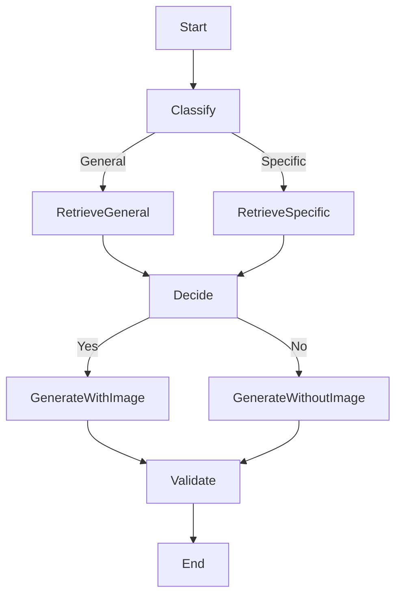

# 🧠 MULTIMODAL RAG

Modular, instruction-bound multimodal RAG chatbot.

Users can upload a PDF document (including images), ask questions, and receive structured answers with optional:

-   ✅ Image
-   📅 Captioned explanation
-   🎧 Audio narration (via ElevenLabs)

It leverages the best of modern AI tooling:

-   **LlamaParse** for accurate PDF parsing
-   **Qdrant + CLIP** for text and image search
-   **LangGraph** for orchestrating custom workflows
-   **Guardrails** for response validation
-   **Mem0** for scoped memory
-   **GPT-4o or TogetherAI vision models** for reasoning

## 🚀 Quickstart

```bash
git clone https://github.com/DigitalProductschool/AI-Makerspace.git
cd AI-Makerspace/RAGs/MultiModal_RAG
python -m venv venv
.\venv\Scripts\activate on Windows
pip install -r requirements.txt
streamlit run app.py
```

### ⚙️ Environment Variables

Create a \``` .env`  `` file:

```ini
OPENAI_API_KEY=...
TOGETHER_API_KEY=...
LLAMAPARSE_API_KEY=...
MEM0_API_KEY=...
ELEVENLABS_API_KEY=...
```

## 📂 Project Structure

```bash
.
├─ app.py                   # Streamlit frontend
├─ rails/response_validator.rail  # Guardrails JSON schema
├─ modules/
│   ├─ pdf_parser.py         # LlamaParse + PyMuPDF
│   ├─ retriever.py          # Qdrant + CLIP/embedding utils
│   ├─ llm_respond.py        # GPT-4o response generation
│   ├─ flow_controller.py     # LangGraph workflow
│   ├─ memory.py             # Mem0 memory integration
│   ├─ tts.py                # ElevenLabs audio
│   ├─ utils.py              # Common helpers
│   └─ providers/llm_provider.py
└─ tests/                  # Unit & integration tests
```

## 🔍 Modules Overview

### `pdf_parser.py`

-   Extracts text using **LlamaParse**
-   Extracts images via **PyMuPDF (fitz)**
-   Immediately captions each image with **vision LLM**

### `retriever.py`

-   Embeds text chunks with **OpenAI embeddings**
-   Embeds images with **CLIP**
-   Stores/retrieves via **Qdrant**
-   Supports RAG-style captioning with query context

### `llm_respond.py`

-   Formats prompt using **llama-index ChatMessage + ImageBlock**
-   Generates final JSON responses using GPT-4o / TogetherAI
-   Validates with **Guardrails**
-   Includes logic to decide if images should be shown

### `flow_controller.py`

-   Built with **LangGraph**, defines this flow:



### `memory.py`

-   Stores turn history per `user_id + doc_id`
-   Uses **Mem0** for scoped memory
-   Supports k-shot recall for follow-up queries

### `tts.py`

-   Text-to-speech via **ElevenLabs API**
-   Returns audio bytes to be played in Streamlit

### `utils.py`

-   Caption text shortening
-   Image encoding/decoding
-   Cosine similarity
-   Test PDF/image generation helpers

## 📅 Example Use

Upload a PDF like "EU’s Artificial intelligence act".

Ask: `Explain pyramid of risks.`

The bot will:

1.  Find the image + text describing risk hierarchy
2.  Decide the pyramid is highly relevant
3.  Render image, caption, and voice answer

## 📄 Related Links

-   [LangGraph](https://www.langchain.com/langgraph)
-   [Guardrails](https://www.guardrailsai.com/)
-   [LlamaParse](https://www.llamaindex.ai/blog/llamaparse)
-   [CLIP](https://openai.com/research/clip)
-   [Qdrant](https://qdrant.tech)
-   [Mem0](https://mem0.ai)
-   [ElevenLabs](https://www.elevenlabs.io)
